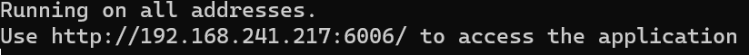

# Image_Recognition_WebGUI

✨ **An Alzheimer's intelligent diagnosis web application based on 3D Convolutional Neural Network and the ADNI Dataset**: AI artificial intelligence image recognition-Pytorch; visualization Web graphic interface-Pywebio; nii medical image recognition. 100% pure Python.

🚩[简体中文文档](./README.md)

[Lightweight version link](https://github.com/bytesc/Image-Recognition-system) includes model training code

[Personal website: www.bytesc.top](http://www.bytesc.top) includes a lightweight version of the online demo.

[Personal blog: blog.bytesc.top](http://blog.bytesc.top) 

🔔 If you have any project-related questions, feel free to raise an `issue` in this project, I will usually reply within 24 hours.

## Feature Introduction

- 1, Intelligent diagnosis of Alzheimer's disease based on brain MRI medical images.
- 2, Draw parameter correlation heat map.
- 3, Written in pure python, lightweight, easy to reproduce, easy to deploy.
- 4, High code readability, with extremely detailed comments in the core part.

## Interface Display

- Enter the web interface
  
- Click "Use demo.nii" to test the recognition function using the default demo image.
  
- You can also upload your own medical images.
  
- Click "View Image" to render the parameter heat map.
  
  
- Generate a parameter correlation heat map based on the uploaded image.
  

## How to use

Python version 3.9

Requires `8GB` or more memory.

First install dependencies.

```bash
pip install -r requirement.txt
```

demo01.py is the project entry point. Run this file to start the server.

```bash
python demo01.py
```

Copy the link to your browser and open it.

Click "Demo" to enter the Web interface.


After that, you can click "Use demo.nii" to use the default test case. You can also click "Upload.nii" and select different types of image files from the readme_static/test folder for testing.

## Project Structure

```
└─Image_Recognition_WebGUI
    ├─data
    │  └─model_save
    ├─imgs
    │  ├─img_hot
    │  ├─img_merge
    │  └─img_raw
    ├─nii
    ├─readme_static
    │  ├─readme_img
    │  └─test
    │      ├─AD
    │      ├─CN
    │      ├─EMCI
    │      ├─LMCI
    │      └─MCI
    └─run_logs
```

- The data folder stores some static resources, and the model_save folder stores trained models.
- The imgs folder stores rendered images.
- The nii folder stores user-uploaded medical image data.
- readme_static stores static resources used in readme documents.
- The readme_static/test folder contains some image files of five categories that can be used for testing.
- run_logs stores user access logs.


## Core code of the classifier

```python
from torch import nn
import torch

class ClassificationModel3D(nn.Module):
    """Classification model"""
    def __init__(self, dropout=0.4, dropout2=0.4):
        nn.Module.__init__(self)

        # Define four Conv3d layers
        self.Conv_1 = nn.Conv3d(1, 8, 3)  # Input channel is 1, output channel is 8, kernel size is 3x3x3
        self.Conv_2 = nn.Conv3d(8, 16, 3)  # Input channel is 8, output channel is 16, kernel size is 3x3x3
        self.Conv_3 = nn.Conv3d(16, 32, 3)  # Input channel is 16, output channel is 32, kernel size is 3x3x3
        self.Conv_4 = nn.Conv3d(32, 64, 3)  # Input channel is 32, output channel is 64, kernel size is 3x3x3

        # Define four BatchNorm3d layers, one after each convolution layer
        self.Conv_1_bn = nn.BatchNorm3d(8)
        self.Conv_2_bn = nn.BatchNorm3d(16)
        self.Conv_3_bn = nn.BatchNorm3d(32)
        self.Conv_4_bn = nn.BatchNorm3d(64)

        # Define four MaxPool3d layers, one after each convolution layer
        self.Conv_1_mp = nn.MaxPool3d(2)  # Pooling kernel size is 2
        self.Conv_2_mp = nn.MaxPool3d(3)  # Pooling kernel size is 3
        self.Conv_3_mp = nn.MaxPool3d(2)  # Pooling kernel size is 2
        self.Conv_4_mp = nn.MaxPool3d(3)  # Pooling kernel size is 3

        # Define two fully connected layers
        self.dense_1 = nn.Linear(4800, 128)  # Input dimension is 4800, output dimension is 128
        self.dense_2 = nn.Linear(128, 5)     # Input dimension is 128, output dimension is 5. Since this is a five-class problem, the final output dimension must be 5

        # Define ReLU activation function and dropout layer
        self.relu = nn.ReLU()
        self.dropout = nn.Dropout(dropout)   # Prevent overfitting
        self.dropout2 = nn.Dropout(dropout2) # Enhance robustness

    def forward(self, x):
        # First convolutional layer
        x = self.relu(self.Conv_1_bn(self.Conv_1(x)))
        """
        This line of code performs convolutional, batch normalization and ReLU activation operations on the input x.

        self.Conv_1(x) performs a 3D convolution operation on the input x and outputs a feature map.

        self.Conv_1_bn(...) performs batch normalization on the feature map output by the convolution operation to obtain a normalized feature map.

        self.relu(...) performs a ReLU activation function operation on the normalized feature map to obtain an activated feature map.

        The purpose of this operation is to extract features from the input x and nonlinearize them so that the network can better learn these features. The batch normalization technique used here can accelerate the training process of the model and improve its generalization ability. The final output result is a feature map x processed by convolutional, batch normalization and ReLU activation functions.
        """
        # Max pooling of the first convolutional layer
        x = self.Conv_1_mp(x)
        """
        This line of code performs a maximum pooling operation on the input x to reduce the size of the feature map by half.

        self.Conv_1_mp(...) performs a maximum pooling operation on the input x with a pooling kernel size of 2.

        The pooling operation extracts the maximum value in each pooling window in the feature map as the value at the corresponding position in the output feature map, thereby reducing the size of the feature map by half.

        Maximum pooling can help the network achieve spatial invariance so that it can recognize the same features when there are slight changes in the input. In this model, after maximum pooling, the feature map x will be passed to the next convolutional layer for feature extraction and nonlinear processing.
        """
        
        # Second convolutional layer
        x = self.relu(self.Conv_2_bn(self.Conv_2(x)))
        # Max pooling of second convolutional layer
        x = self.Conv_2_mp(x)
        # Third convolutional layer
        x = self.relu(self.Conv_3_bn(self.Conv_3(x)))
        # Max pooling of third convolutional layer
        x = self.Conv_3_mp(x)
        # Fourth convolutional layer
        x = self.relu(self.Conv_4_bn(self.Conv_4(x)))
        # Max pooling of fourth convolutional layer
        x = self.Conv_4_mp(x)
        # Flatten tensor into a one-dimensional vector
        x = x.view(x.size(0), -1)
        """
        This line of code flattens the input tensor x into a one-dimensional vector.

        x.size(0) gets the size of the first dimension of the input tensor x, which is the batch size of the tensor.

        -1 means to flatten the second dimension and all dimensions after it into one dimension.

        x.view(...) performs a shape transformation on the input tensor x, flattening it into a one-dimensional vector.

        The purpose of this operation is to transform the feature map x processed by convolution and pooling into a one-dimensional vector so that it can be passed to the fully connected layer for classification or regression tasks. The size of the flattened vector is (batch_size, num_features), where batch_size is the batch size of the input tensor and num_features is the number of elements in the flattened vector, which is also the number of features after convolution and pooling processing.
        """

        # dropout layer
        x = self.dropout(x)
        """
        This line of code performs a dropout operation on the input tensor x, i.e., sets some elements of the input tensor to zero with a certain probability.

        self.dropout(...) performs a dropout operation on the input tensor x, with a dropout probability of dropout.

        The dropout operation sets some elements of the input tensor to zero with a certain probability, achieving the purpose of random deactivation. This can reduce overfitting and enhance the generalization ability of the model.

        In this model, the dropout operation is applied before the fully connected layer, which can help the model better learn the features of the data and prevent overfitting. The resulting x tensor is the result after the dropout operation and will be passed to the next fully connected layer for processing.
        """
        # fully connected layer 1
        x = self.relu(self.dense_1(x))
        """
        This line of code performs a fully connected operation on the input tensor x and applies the ReLU activation function.

        self.dense_1(x) performs a fully connected operation on the input tensor x, mapping it to a feature space of size 128.

        self.relu(...) applies the ReLU activation function to the output of the fully connected layer to obtain an activated feature vector.

        In this model, the role of the fully connected layer is to map the feature vector processed by convolution, pooling, and dropout to a new feature space for classification or regression tasks. The role of the ReLU activation function is to nonlinearize the feature vector so that the network can better learn the nonlinear correlation in the data. The resulting x tensor is the result after processing by the fully connected layer and ReLU activation function and will be passed to the next dropout layer for processing.
        """
        # dropout2 layer
        x = self.dropout2(x)
        # fully connected layer 2
        x = self.dense_2(x)
        # return output result
        return x


if __name__ == "__main__":
    # create an instance of ClassificationModel3D class named model, i.e., create a 3D image classification model
    model = ClassificationModel3D()

    # create a test tensor test_tensor with shape (1, 1, 166, 256, 256),
    # where 1 represents batch size, 1 represents input channel number, 166, 256 and 256 represent depth, height and width of input data respectively
    test_tensor = torch.ones(1, 1, 166, 256, 256)

    # perform forward propagation on test tensor test_tensor to obtain output result output from model
    output = model(test_tensor)

    # print shape of output result, i.e., (batch_size, num_classes), where batch_size is batch size of test tensor and num_classes is number of classes in classification task
    print(output.shape)

```

ref: https://github.com/moboehle/Pytorch-LRP

Datasets: https://adni.loni.usc.edu


